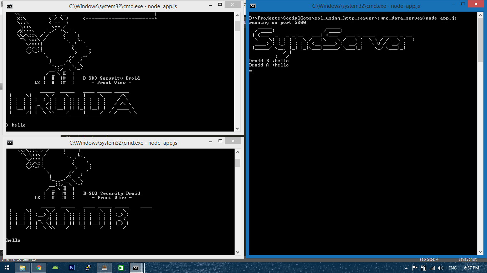

# SC_task
Droid Problem

- clone project using `git clone https://github.com/Jatinbalodhi96/SC_task.git`
- goto `sync_data_server` and run `$ node app.js`
- goto `droid_A_server` and run `$ node app.js`
- goto `droid_A_server` and run `$ node app.js`

#### send messages to `sync data server` using console of console of `droid_A_server` and `droid_A_server`.
The data will be saved in `synced_data.txt` in `sync_data_server` directory.
